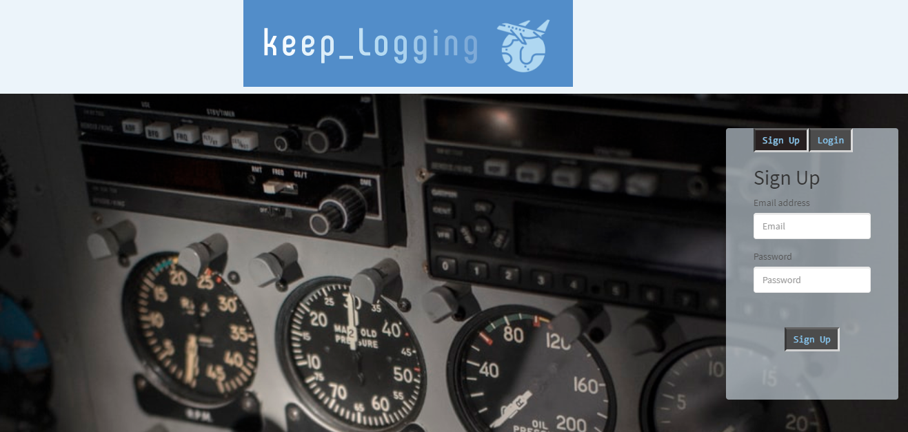
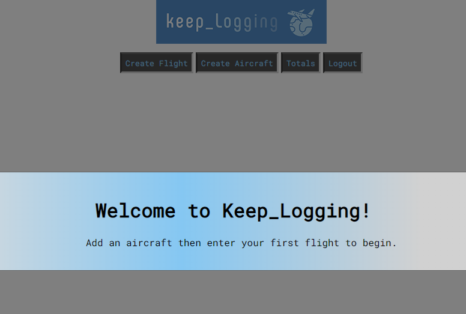
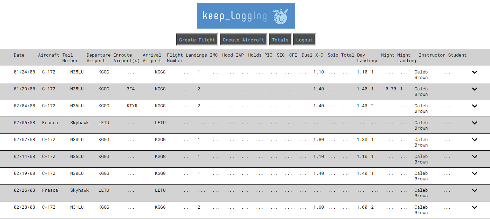
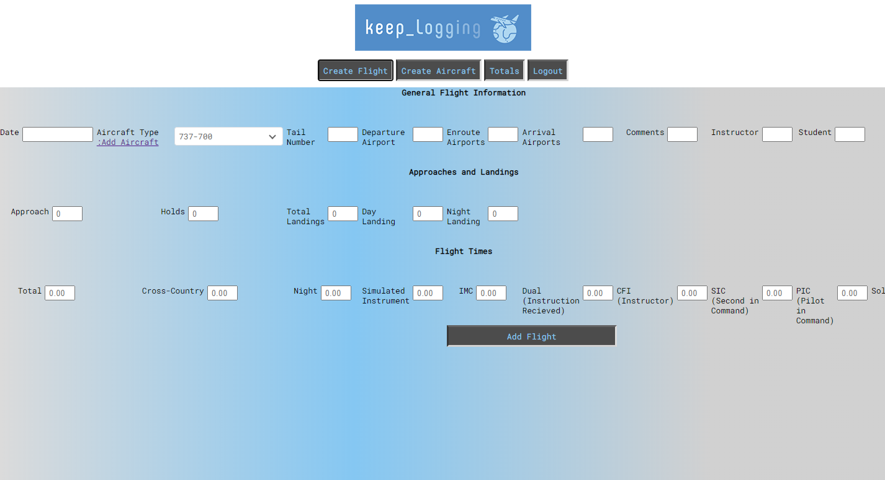
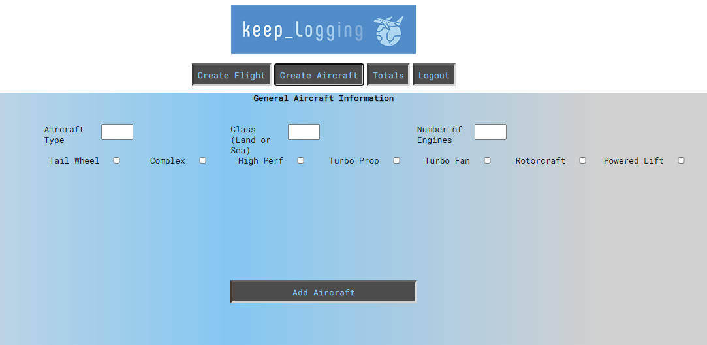

# Logbook
The purpose of this project was to start creating an electronic logbook that pilots can use to keep track of their flight information. This project has many possibilities that we look forward to pursuing in time. This project gave us the opportunity to implement several new technologies including tippyJS, SlimSelect, SCSS, authentication, and importing from a CSV. keep Logging was our first build from the bottom up to include the server. 

[Github Repository](https://github.com/cloudflying87/keepLogging)

[Deployed Heroku Application](https://fathomless-thicket-06721.herokuapp.com/login)