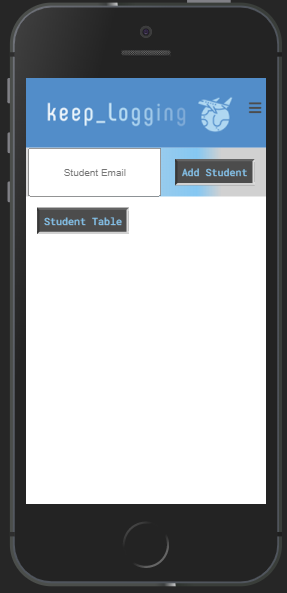

# Keep Logging

## App

Find the deployed app [here](https://keeplogging.herokuapp.com/)

## Introduction

Keep Logging is a mobile responsive electronic logbook for pilots, inspired by [Myflightbook](https://myflightbook.com) and a very detailed, comprehensive, and impressive Excel spreadsheet by project leader [David Hale](https://github.com/cloudflying87).  

## Features

The user is taken to a signup page on visiting the site. Here they can log in or create a new account.

After logging in, the user will be presented with their logbook. A user can add a flight, click on a flight for more information, search through their flights by date, or view their totals.

Add and view aircraft in their virtual hangar.

View Airports 

Here, an instructor can add the email address of their student. The student will recieve an email to confirm the invitation. Once confirmed, the instructor will be able to view and add flights to the student's table. In a future release, the instructor will be able to add a digital signature or other verification to flights.

## Frameworks and Technology

- Node.js
  - Express.js
  - Sequelize
  - Nodemailer
  - Passport.js

- React.js
  - Moment.js
  - Chart.js
  - react-transitions-group
  - google-map-react
  - react-slick
  - react-select
  - axios

## Future Development

- Instructors can add flights to the student's table
- Instructors can add a digital signature to a student's flight
  - Add an iacra from total
- Upload images to the flight
- Import logbooks through .kml file
- Export logbooks to .pdf and .kml
- Print logbook in a nice looking format
- Search and sort flights in more ways
- Dark mode
- Social media sharing options
- User preference tab 
  - auto-log on clock times
  - multi-factor-authentication

## Dev Team

- [David Hale](https://github.com/cloudflying87)
- [Coby Sher](https://github.com/CobyPear)
- [Austin Kramer](https://github.com/AKKramer)